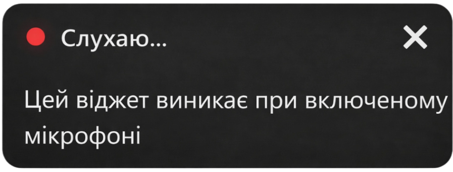

## Інструкція

### 🦜 Golos — голосовий ввід тексту для Chrome

#### 1. Навіщо це розширення

**Golos** — це розширення для браузера Chrome, яке дозволяє диктувати текст голосом і автоматично вставляти його в будь-яке текстове поле: пошту, месенджери, документи, форми, чати та інші вебсайти.

Розширення створене для:

- швидкого набору тексту без клавіатури;
- економії часу;
- комфортної роботи з великими обсягами тексту;
- коректної пунктуації під час диктування.

---

#### 2. Як встановити Golos

1. Перейдіть до **Chrome Web Store**.
2. Знайдіть розширення **Golos**, або натисніть це посилання.
3. Натисніть **“Додати в Chrome”**.
4. Підтвердьте встановлення.

Після встановлення іконка Golos  з’явиться на панелі розширень браузера.

---

#### 3. Як надати дозволи Chrome

Для коректної роботи Golos потрібні стандартні дозволи браузера:

- доступ до активної вкладки;
- доступ до мікрофона.

Chrome автоматично зробить запит на дозвіл використання мікрофону **під час першого диктування**.
Потрібно натиснути **“Дозволити”**.

 

> ⚠️ Без доступу до мікрофона диктування неможливе.

---

#### 4. Як диктувати текст?

1. Клікніть у будь-яке текстове поле на сайті (наприклад, у WhatsApp, Gmail чи Word Online).
2. Натисніть комбінацію клавіш:

**Alt + Shift + G**

або іконку  на панелі розширень. Відкриється компактний віджет Golos:

3. Почніть говорити. У вікні віджету ви бачитимете, як розпізнається мова.
4. Chrome автоматично буде переносити в поле вводу, обробляючи команди, заміняючи їх знаками пунктуації.

**💡 Наприклад**
Щоб поставити знак, просто назвіть його:

- 🗣 _"Привіт **кома** як справи **знак питання**"_ → `Привіт, як справи?`
- 🗣 _"Новий рядок"_ → Перехід на новий рядок.
- 🗣 _"Абзац"_ → Перехід на новий рядок через один.
- 🗣 _"Дужка відкривається"_ / _"Дужка закривається"_ → `(` `)`
- 🗣 _"Тире"_ → `—`

5. Для завершення диктування натисніть **Alt + Shift + G** ще раз, чи іконку  на панелі розширень Google Chrome, або кнопку закриття у віджеті.

---

#### Додаток: Голосові команди (пунктуація та символи)

Під час диктування ви можете **називати знаки пунктуації та символи голосом** — Golos автоматично перетворить їх у відповідні знаки.

##### Розділові знаки

- **«крапка з комою»** → `;`
- **«двокрапка»** → `:`
- **«кома»** → `,`
- **«крапка»** → `.`
- **«знак питання»** → `?`
- **«знак оклику»** → `!`

##### Дефіси та тире

- **«дефіс»** → `-`
- **«тире»** → `—`

##### Переноси рядка

- **«новий рядок»** → перехід на новий рядок
- **«абзац»** → порожній рядок + новий рядок

##### Дужки

- **«дужка відкривається»** → `(`
- **«дужка закривається»** → `)`

##### Лапки

- **«лапки»** → `"`
- **«відкрити лапки»** → `«`
- **«закрити лапки»** → `»`

##### Спеціальні символи

- **«смайлик»** → `🙂`
- **«амперсанд»** → `&`
- **«зворотна коса риска»** → `\`
- **«коса риска»** → `/`
- **«центрована точка»** → `·`
- **«знак градуса»** → `°`
- **«нижнє підкреслення»** → `_`
- **«вертикальна риска»** → `|`

##### Валюти

- **«долар»** → `$`
- **«євро»** → `€`
- **«фунт»** → `£`
- **«гривн»** → `₴`

💡 **Додатково**

- Сказане **«грн»** або **«грн.»** автоматично перетворюється на `₴`.
- Для слів **«гривн…»**, **«долар…»**, **«фунт…»** знак валюти підставляється незалежно від закінчення слова.

---

#### 5. Як відкрити опції Golos

Існує два способи:

**Спосіб 1:**

- Натисніть правою кнопкою миші на будь-якій сторінці.
- Оберіть **“⚙️ Налаштування Golos”**.

**Спосіб 2:**

- Відкрийте сторінку керування розширеннями Chrome.
- Знайдіть Golos.
- Натисніть **“Параметри”**.

В опціях можна:

- обрати мову розпізнавання;
- переглянути інформацію про версію розширення.

---

**Технічна підтримка:**
📧 [support](mailto:airteg@ukr.net)
